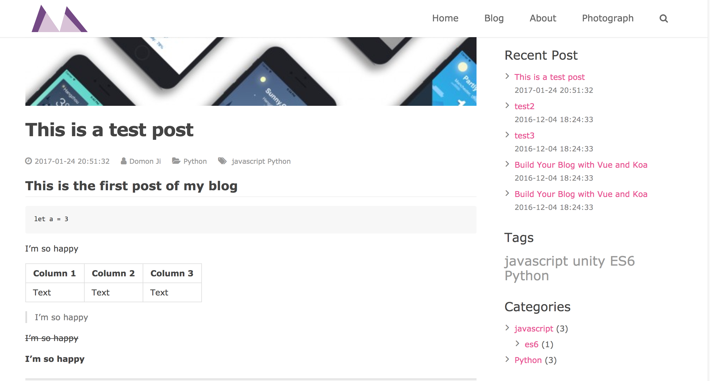
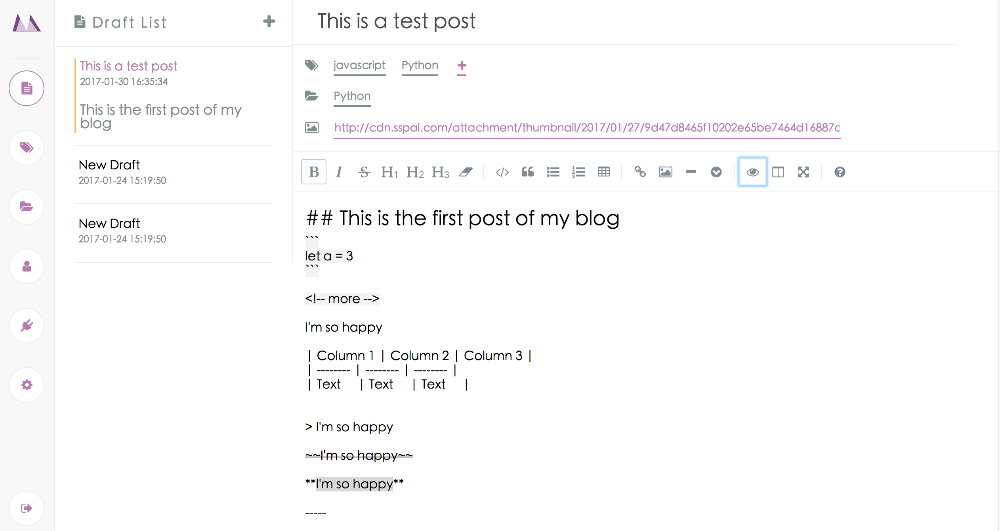

# Monkov

<center>
  
</center>

> Monkov is a blog system built with vue.js and koa.js You can easily build up your own blog with it.

## Dependencies

- nodejs 6.0 or higher
- mongodb

## Features

- RESTful api
- Front end router
- Front and back seperated
- ES6/7 syntax
- Built-in markdown editor
- Add tags and category to your articles

## Modules

### Client

The blog pages on your website.

You can customize the widgets, the themes, the navigation menu and the personal informations.

More features are comming.

#### Demo



#### Tech Stack

- vuejs 2.0 + && vue-router
- fetch
- stylus
- marked

#### Usage

```shell
$ yarn install

# run dev-server
$ npm run dev-client

# build
$ npm run build-client
```

--------------------------------------------------------------------------------

### Server

The server of this blog system, built with koa 2.0 and mongoose.

The login module use `jwt`

#### Tech Stack

- koa 2.0
- mongoose
- jwt

#### Usage

```shell
$ yarn install

# run development
$ npm run dev-server

# run production
$ npm run pro-server
```

--------------------------------------------------------------------------------

### Admin

The background management system. You can write your articles (all called `draft` when not published) here with the built-in markdown editor. You can publish and deleting posts, modifying your tags and categories and all the changes will automatically synchronize to your blog pages.

Initial username:`admin` Initial password:`admin`

#### Demo



##### Tech Stack

- vuejs 2.0 + && vue-router && vuex
- fetch
- stylus
- marked && SimpleMDE

##### Usage

```shell
$ yarn install

# run dev-server
$ npm run dev

# build
$ npm run build
```

## Todo List

- [ ] Add comments to code
- [ ] CSS refactor
- [ ] Comment system
- [ ] Category management
- [ ] Customizable themes
- [ ] User management system
- [ ] Plugin system
- [ ] Customizable header, footer and widgets
